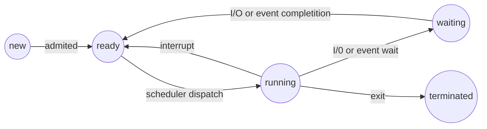
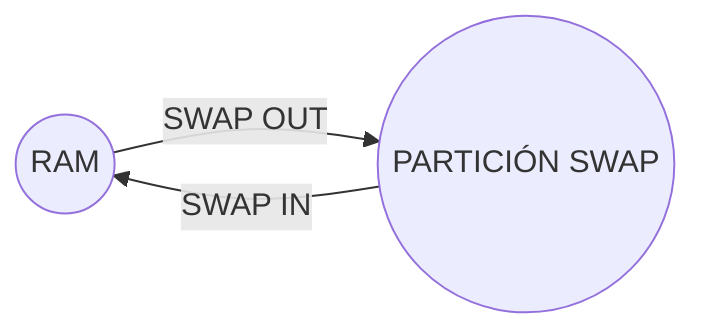
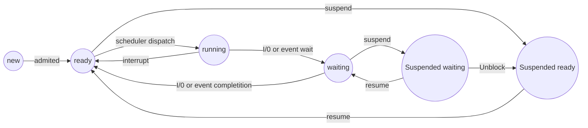

# Procesos e Hilos
## Índice

 - **Procesos**
	 - ¿Que es un proceso?
	 - Composición de un proceso
	 - PCB
	 - Estados de un proceso
     - Swapping
     - Planificadores
     - Cambio de contexto
        - ¿Que se puede dar en un cambio de contexto?
  - **Hilos**
    - ¿Que es un hilo?
    - TCB
    - Diferencias con procesos
    - KLT - ULT
        - KLT
        - ULT
    - Dinamica de estados

## Procesos
Empecemos por lo más básico *¿Qué es un proceso?*. 
> **Def**: Es un programa en ejecución. Se suele decir que el *programa* es la entidad pasiva  
y el *proceso* es la activa

### Composición de un proceso

Un proceso está compuesto por:  
- **Text**: Es el código escrito y fijo del proceso.  
- **Data**: Es aquella que envuelve a todas las variables globales, de tamaño fijo.
- **Heap**: En el *heap* se encuentra la memoria dinámica, Una forma de hacer crecer al *heap* es a través de la función *malloc()*, a la hora de pedir memoria.  
- **Stack (o pila)**: Dentro de esta se encuentran las variables locales, los retornos de funciones, y los parámetros de funciones (que terminan siendo variables locales). El *stack* es dinámico, de tamaño variable. El famoso *stack overflow* se genera cuando la memoria dada a dicha *stack* se supera, es decir, se queda sin memoria.

### PCB (Process Control Block)
Posee la información necesaria para que el SO administre el proceso. Está asociada al proceso

- ID
- Estado de proceso o *process status*
- Contador de programa, *program counter (PC)* o *instruction pointer (IP)*
- Registros de la CPU *(AX, BX, CX, DX)*
- Información de la CPU
- Información de planificación de la CPU
- Información de gestión de memoria
- Información contable
- Información de estado de E/S
- Punteros

**Siempre está cargado en RAM. Se podría decir que el sistema operativo usa de índice al PCB, necesita ingresar al mismo para, por ejemplo, ingresar al stack o al heap del proceso, mediante un puntero.**

### Estados de un proceso

- *New*: Se crea la PCB, pero le faltan datos para estar listo para su ejecución (*No es planificable*)
- *Ready*: Su PCB está completa después de ser admitido y está esperando la orden del SO para ser ejecutado
- *Running*: Se están ejecutando sus instrucciones
- *Waiting/Block*: Está esperando que ocurra un evento
- *Terminated*: Finalizó la ejecución

>Todos los procesos pueden ir a Terminated cuando el SO lo requiera, sin pasar por los estados de por medio.

>Grado de multiprogramación: Es la cantidad de procesos cargados en memoria. Cada vez que un proceso va de new a ready, entra en memoria y ocupa un puesto de multiprogramación

>Grado de multiprocesamiento: Es el límite de $n$ procesos corriendo al mismo tiempo en *running*, limitado por la cantidad de núcleos del procesador

### Swapping

Podemos pasar a disco procesos en blocked que están en memoria

Juntando todos esto, nos queda el gráfico así

### Planificadores

- ***Extra largo plazo***: Realmente no existe, pero la realiza el administrador (Ej: `Ctrl + ALT + Suprimir`)
- **Largo plazo**: Se controla el grado de multiprogramación
    - new -> ready
    - cualquier estado -> exit
- **Mediano plazo**: Se controla la suspensión de procesos
    - ready/blocked -> suspended ready/blocked (y viceversa)
- **Corto plazo**: Se controla el grado de multiprocesamiento. Ve quienes de los procesos ready pasan a exec. Y también libera a ready, y deja de ejecutarlo.
    - ready -> exec (y viceversa)

### Cambio de contexto

Cuando se cambia el proceso que posee la CPU, se debe guardar su contexto de ejecución para renaudarlo en el lugar interrumpido.

El cambio de contexto puede realizarse para:
- Ejecutar otro proceso
- Atender una interrupción (exec interrupt handler)
- Ejecutar una syscall

> Overhead: El tiempo que dura un cambio de ocntexto es un gasto extra. Es necesario para poder ejecutar procesos pero durante el mismo, el sistema no hace ningún trabajo útil (para el usuario). Ese tiempo se denomina *OVERHEAD*

#### ¿Que se puede dar en un cambio de contexto?

- *Si hay un cambio de proceso* $=>$ Hay dos cambios de contexto (Se guarda el contexto de un proceso y se restaura el de otro)
- *Si hay dos cambios de contexto* $=>$ **NO necesariamente** hay un cambio de proceso (Se puede elegir al mismo proceso, ejecutar una syscall, atender una syscall, atender una interrupción, etc)
- *Si hay cambio de modo* $=>$ Hay un cambio de contexto (Y sí, sino para que corno cambie de modo ¿no?)
- *Si hay un cambio de contexto* $=>$ **NO necesariamente** hay un cambio de modo, (Puede ocurrir una interrupción cuando ya estoy atendiendo una)

## Hilos

### ¿Que es un hilo?

> Es la mínima unidad de utilización de la CPU. Consiste en un juego de registros y un espacio de pila. Se lo conoce como proceso ligero

- Comparte el código, los datos y los recursos con sus hilos pares.
- Un proceso está formado por uno o más hilos de ejecución.
- Cada hilo es administrado por un TCB, cuya referencia se encuentra en el PCB del proceso al que está asociado
- Permiten paralelismo dentro de un proceso o aplicación.
- Al compartir recursos, pueden comunicarse sin usar ningún mecanismo de comunicación inter-proceso del SO.
- No hay protección entre hilos. Un hilo puede escribir en la pila de otro hilo del mismo proceso.

**Los hilos no comparten ni sus registros ni sus stacks entre ellos**

### TCB (Thread Control Block)

Es lo mínimo que necesito para administrar los hilos

### Diferencias con procesos

- Permiten la comunicación privada entre varios hilos del mismo proceso, sin intervención del SO.
- Mayor eficiencia en el cambio de un hilo a otro, que de un Proceso a otro, debido a que solo voy a tener que cambiar dos estructuras, los registros y la stack.
- Mayor eficiencia en la creación de un hilo que en la creación de un Proceso Hijo, ya que solo voy a tener que crear dos estructuras, los registros y la stack.
- Un Proceso Multihilo puede recuperarse de la “muerte” de un Hilo, pues conoce los efectos de esta, y toma su espacio de memoria (excepto para el hilo main).
- Cuando un proceso “muere”, generalmente todos sus hilos también pues los recursos del proceso son tomados por el Sistema Operativo.

### KLT - ULT

#### KLT
- Los KLTs son llamados “Hilos a nivel de Kernel” o "nativos".
- El SO conoce de su existencia y controla su ejecución

#### ULT
- Los ULTs son llamados “Hilos a nivel de usuario” o "Green Threads". 
- Su gestión es realizada por bibliotecas en modo usuario, y por lo tanto, el SO no sabe de la existencia de estos hilos.
- Características:
    - Realizan la conmutación de contexto aún más rápidamente.
    - Cuando uno de ellos realiza una operación bloqueante (ej. E/S), sus hilos pares no pueden continuar.
    - No permiten paralelismo entre hilos pares.

### Dinamica de estados

El estado del Proceso $P$ es la combinación de los estados de sus Hilos.
- Cuando cualquiera de los Hilos está en estado “**Ejecutando**”, el estado de $P$ será “**Ejecutando**”.
- Si ningún Hilo está en “**Ejecutando**”, si alguno está en “*Listo*”, el estado de $P$ será “*Listo*”.
- El estado de $P$ es “Bloqueado” sólo si todos sus Hilos están en estado “Bloqueado”.

Cuando yo creo hilos, no solo creo los TCBs sino que también los registros y la stack de cada hilo, ya que los TCBs tienen el PUNTERO a los registros y la stack. Al igual que el PCB, no crea dichas estructuras, sino que apunta a ellas.
