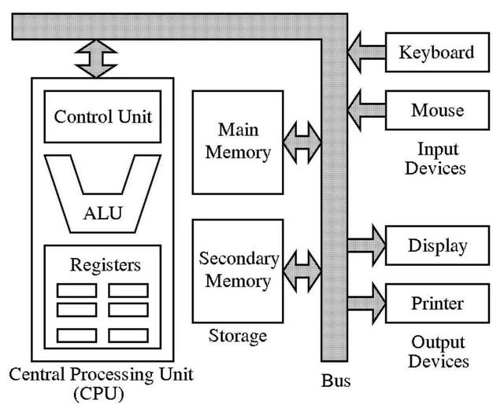
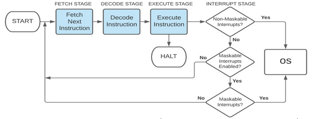
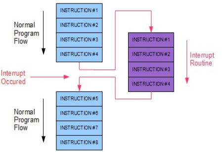
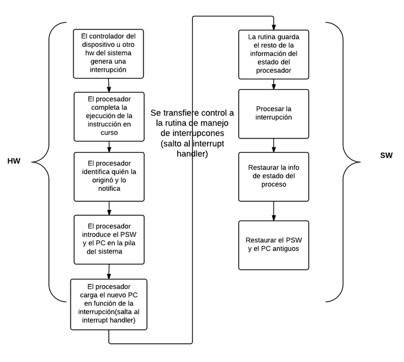
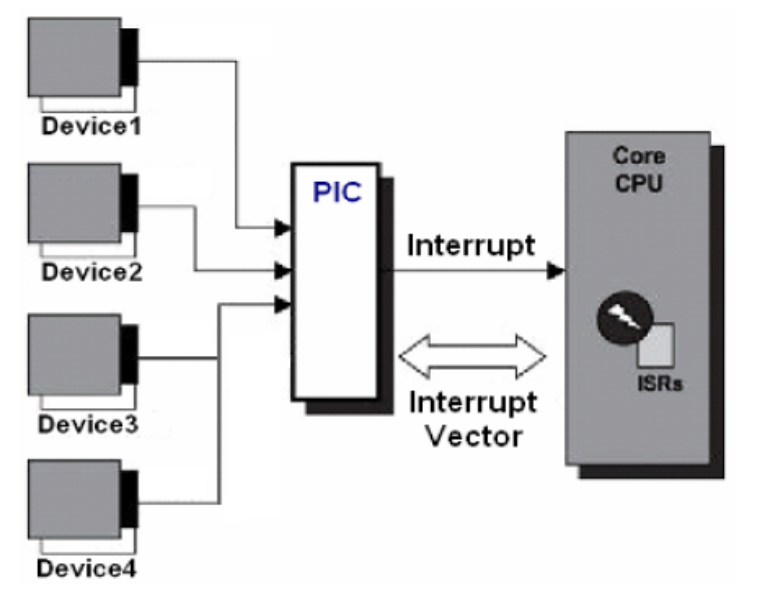
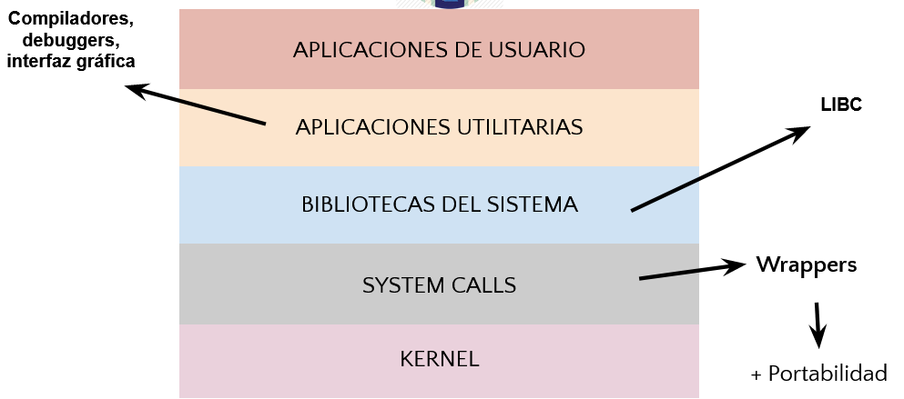
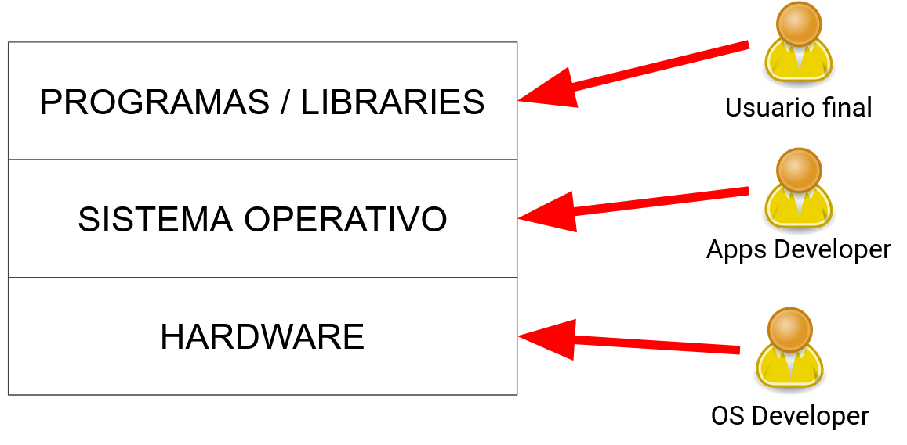
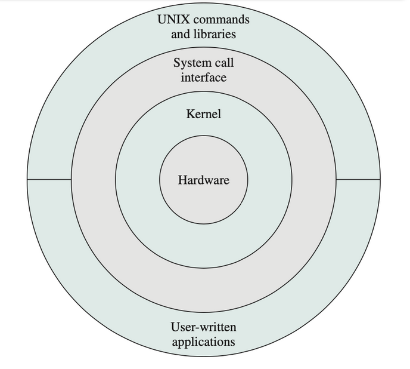

# Repaso De Arquitectura e Introducción a Sistemas Operativos

## Índice
- [Repaso de Arquitectura de Computadores](#repaso-de-arquitectura-de-computadores)  
    - [Componentes básicos de HW](#componentes-básicos-de-hw)
    - [CPU](#cpu)
        - [Funcionalidades de ciertos registros](#funcionalidades-de-ciertos-registros)
            - [Program Counter (PC)](#program-counter-pc)
            - [Instruction Register (IR)](#instruction-register-ir)
            - [Memory Address Register (MAR)](#memory-address-register-mar)
            - [Memory Buffer Register (MBR)](#memory-buffer-register-mbr)
    - [Ciclo de una instrucción](#ciclo-de-una-instrucción)
        - [¿Cómo funciona una interrupción?](#cómo-funciona-una-interrupción)
        - [Interrupt Handler o Controlador de Interrupciones](#interrupt-handler-o-controlador-de-interrupciones)
- [Introducción a los Sistemas Operativos](#introducción-a-los-sistemas-operativos)
    - [¿Qué es un Sistema Operativo?](#qué-es-un-sistema-operativo)
    - [Estructura](#estructura)
    - [Seguridad en los SO](#seguridad-en-los-so)

### Repaso de Arquitectura de Computadores

#### Componentes básicos de HW

#### CPU

La unidad central de procesamiento (conocida por las siglas CPU, del inglés Central Processing Unit) o procesador es un componente del hardware dentro de un ordenador, teléfonos inteligentes, y otros dispositivos programables.

Su función es interpretar las instrucciones de un programa informático mediante la realización de las operaciones básicas aritméticas, lógicas, y externas (procedentes de la unidad de entrada/salida). Su diseño y su avance ha variado notablemente desde su creación, aumentando su eficiencia y potencia y reduciendo el consumo de energía y el coste. 

Los componentes de la CPU son:
- **Unidad Aritmético Lógica** (*Arithmetic Logic Unit o **ALU***): realiza operaciones aritméticas y lógicas
- **Unidad de Control** (*Control Unit o **CU***): dirige el tráfico de información entre los registros de la CPU y conecta con la ALU las instrucciones extraídas de la memoria.
- **Registros Internos**
    -  **Visibles al Usuario**: Son de propósito general, generalmente modificables (Acumuladores como EAX, EBX, CX, etc.)
    - **De control y Estado**: Controlan las operaciones del procesador y no son modificables (SP(*stack pointer*), PC (Program counter), flags como Sign Flag, Zero flag, Carry Flag, etc. Bus de datos y de dirección, etc.)

##### Funcionalidades de ciertos registros

###### Program Counter (PC)

Apunta a la próxima instrucción a ejecutar. Sirve para indicar la posición donde está el procesador en su secuencia de instrucciones.

###### Instruction Register (IR)

Guarda la instrucción que se está ejecutando o decodeando. Cada instrucción a ser ejecutada es cargada en el IR, el cual lo mantiene mientras es decodeada, preparada y al final, ejecutada.

###### Memory Address Register (MAR)

Guarda la dirección en memoria de la data que se quiere leer o escribir. Está conectado al bus de direcciones.

###### Memory Buffer Register (MBR)

Es el encargado de leer y/o escribir la data desde o hacia la memoria RAM. Está conectado al bus de datos. Contiene una copia del valor del dato cuya dirección está almacenado en el MAR. 

#### Ciclo de una instrucción

Primero que nada. **¿Que es una instrucción?**. Es conjunto de datos insertados en una secuencia estructurada o específica que el procesador interpreta y ejecuta. 

Ahora, sabiendo el flujo de una instrucción, podemos ver que hay algo llamado **Interrupciones**.

> ¿Qué es una interrupción? Es un mecanismo mediante el cual los módulos de I/O o la misma CPU puede interrumpir el flujo normal de ejecución.

De estas, existen dos tipos de interrupciones:
- **Enmascarables o de Software:** Son interrupciones el cual el SO puede decidir si atender o posponer a un futuro cercano su atención.
- **No enmascarables o de Hardware:** Son de suma importancia y deben ser atendidas al momento en que llegan. 

##### ¿Cómo funciona una interrupción?

##### Interrupt Handler o Controlador de Interrupciones

Una vez ocurrida una interrupción, el interrupt handler, a través del interrupt vector, buscará la rutina para atender la interrupción y ejecutarla hasta resolverla y volver al flujo original.

### Introducción a los Sistemas Operativos

#### ¿Qué es un Sistema Operativo?

Diferentes definiciones, mismo sistema.
- **Programa de software:** Consume recursos, compite por ellos con el resto de los programas
- **Interfaz entre computadora y usuario/programa:** Provee una capa de abstracción
- **Administrador de recursos y de la seguridad:**
    - Administra recursos de Hardware y de otros programas
    - Es un programa con *superpoderes*
    - Se administra a si mismo

#### Estructura

Podemos también hacer un cuadro en el cual vemos para quienes están enfocados ciertos eslabones y que debería saber ese usuario para desarrollar uno de esos eslabones.

#### Seguridad en los SO

**Tipos de instrucciones**
 - Priviligiadas o Modo Kernel: Son intrucciones que solo pueden ser ejecutadas en Modo Kernel, por el SO.
 - Comunes o Modo Usuario: Son instrucciones que solo pueden ejecutarse en Modo Usuario, si intentan acceder a una instrucción en Modo Kernel, este produce una excepción.

**¿Cómo sabe el SO en que modo está?**
El PSW (Program Status Word), es el que indica en que modo está ejecutandose.

**¿Un programa puede ejecutar una instrucción privilegiada?**

Si y no, puede hacer uso de una **syscall**, que es un mecanismo mediante el cual los programa solicitan servicios al SO.

**Como cambiar de modo**

**De Kernel a Usuario**
- Con una instrucción privilegiada
- Restaurando contexto

**De Usuario a Kernel**
- Interrupción
- Syscall

**¿Qué tan dependiente es un programa de las syscalls del sistema operativo?**

Demasiado, y por eso existen los **wrappers** para tener **simplicidad, portabilidad y eficiencia** a la hora de programar.
