# File System

## Índice
- [Introducción a File System](#introducción-a-file-system)    
    - [¿Qué es un file system?](#qué-es-un-file-system)
        - [Características del File-System](#características-del-file-system)
    - [Objetivos](#objetivos)
    - [¿Qué es un archivo?](#qué-es-un-archivo)
        - [¿Cómo los administramos?](#cómo-los-administramos)
    - [Directorio](#directorio)
        - [Estructura de los directorios](#estructura-de-directorios)
            - [Un nivel](#un-nivel)
            - [Dos niveles](#dos-niveles)
            - [Árbol](#árbol)
            - [Grafo Acíclico](#grafo-acíclico)
            - [Grafo general](#grafo-general)
    - [Operaciones sobre archivos](#operaciones-sobre-archivos)
    - [Locks](#locks)
        - [Tipos de locks](#tipos-de-locks)
        - [Implementaciones de los locks](#implementaciones-de-los-locks)
    - [Manipulación de archivos](#manipulación-de-archivos)
    - [Protección](#protección)
        - [Implementaciones](#implementaciones)
        - [Protección en UNIX](#protección-en-unix)
    - [Organización de los datos en el disco](#organización-de-los-datos-en-el-disco)
        - [Asignación de bloques](#asignación-de-bloques)
            - [Contigua](#contigua)
            - [Enlazada/Encadenada](#enlazadaencadenada)
            - [Indexada](#indexada)
        - [Gestión de espacio libre](#gestión-de-espacio-libre)
    - [Journaling](#journaling)
    - [Archivos mapeados a memoria](#archivos-mapeados-a-memoria)
- [FAT](#fat)
    - [Volumen](#volumen)
    - [Tamaño de entrada FAT](#tamaño-de-entrada-fat)
- [EXT2](#ext2)
    - [Estructura en EXT2](#estructura-en-ext2)
    - [Directorios en EXT2](#directorios-en-ext2)
    - [Softlinks](#softlinks)
    - [Hardlinks](#hardlinks)
    - [Resumen tipos de archivos](#resumen-tipos-de-archivos)
    - [Creación de links](#creación-de-links)

## Introducción a File System

### ¿Qué es un file system?

El File-System en general lo vamos a encontrar siempre como parte del kernel en sistemas monolíticos. Es aquel que da servicio de uso de archivos al S.O, a los usuarios y a los aplicativos

#### Características del File-System
- Es un módulo del sistema operativo
- Maneja el almacenamiento secundario (almacenamiento persistente) y terciario (almacenamiento que se “pone” y se “saca”, dicho rústicamente, como un USB por ejemplo).
- Sus principales funciones son la asignación de espacio a los archivos, la administración del espacio libre y del acceso a los datos
- Idealmente debe garantizar seguridad y coherencia

### Objetivos

- **Almacenar** datos y poder **operar** con ellos
- Garantizar (en lo posible) la **integridad** de los datos
- Optimizar **desempeño** 
    - **Usuarios**-> tiempo de respuesta
    - **Sistema** -> aprovechamiento de los recursos
- Proveer soporte para distintos **tipos de almacenamiento**
- **Minimizar** o eliminar la **pérdida** o destrucción potencial de datos
- Proveer una **interfaz estandarizada** para procesos de usuario
- Soporte para **múltiples usuarios** -> ¿Qué puede hacer un usuario con los archivos de otro?

### ¿Qué es un archivo?

> *Def*: Conjunto de datos/registros **relacionados etiquetados** con un nombre y **almacenados** en un medio secundario

**Características**
- Existencia de larga duración
- Compartible entre procesos -> **archivo = nombre + permisos asociados**
- Estructura

#### ¿Cómo los administramos?

Con la ayuda de un FCB (File Control Block)

**FCB**:
 - File permissions
 - File datas (create, access, write)
 - File owner, group, ACL
 - File size
 - File data block or pointers to file data blocks

### Directorio

¿Que es un directorio? Es un tipo especial de archivo, que contiene un listado de nombres de otros archivos (que también podrían ser directorios) y sus atributos asociados. Es de tipo directorio.

|Directorio /test|
|-|
|-rw-r--r--    1 nponzo  ML\Domain Users  14 Aug 25 21:45  **file1**|
|-rw-r--r-x    1 nponzo  ML\Domain Users   0 Jun  4  2016   **file2**|
|drwxr-xr-x  2 nponzo  ML\Domain Users  68 Aug 22 21:44  **otherDir**|
|drwxr-xr-x  2 nponzo  ML\Domain Users  68 Aug 23 21:44  **yetAnotherDir**|

Permite realizar el mapeo entre nombres (conocidos por usuarios y aplicaciones) y los archivos en sí.

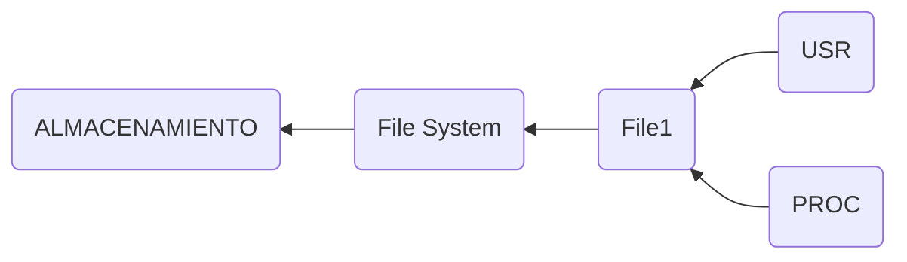

#### Estructura de Directorios

##### Un nivel

- Todos los archivos juntos, no se podrían repetir nombres

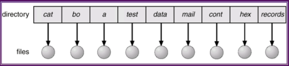

##### Dos niveles

- Un directorio por usuario
- El path se define por <usuario/nombre_archivo>

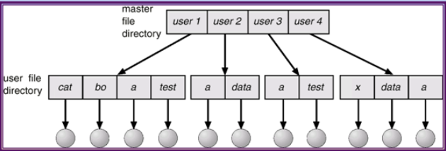

##### Árbol

- Rutas relativas vs absolutas

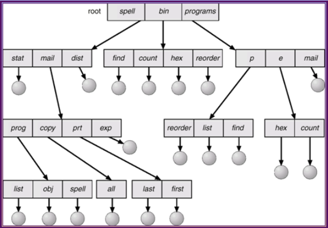

En general, estas dos estructuras no se suelen utilizar

##### Grafo Acíclico

- [Links!]() (ya lo veremos más en detalle)

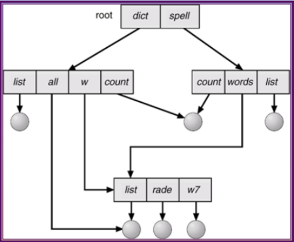

##### Grafo general

[¿Ciclos de directorios?]() (ya lo veremos más en detalle)

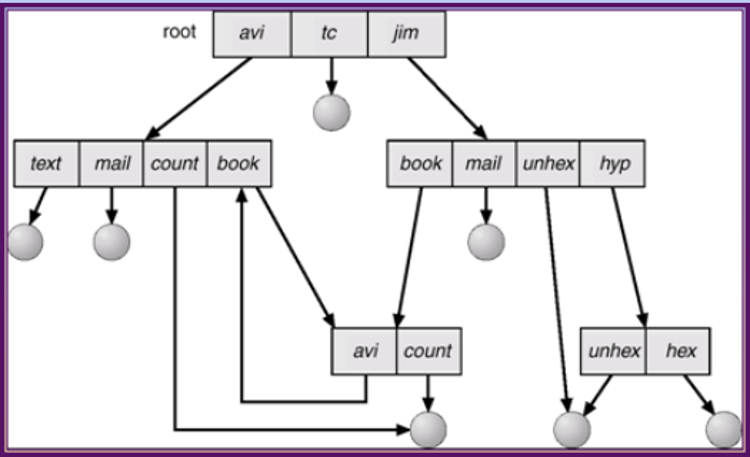

La mayoría de los file-systems se inclinan por el lado de los grafos acíclicos, ya que lo que pasa con el grafo general es que pueden apuntar a los mismos directorios, como pasa con el gráfico, lo cual no pasa con los acíclicos.

### Operaciones sobre archivos

- **Crear**: definir un nuevo archivo y se lo posiciona dentro de la estructura de archivos.
- **Eliminar**
- **Abrir**: se declara un archivo existente como “abierto” por un proceso, permitiendo al mismo realizar futuras operaciones sobre el archivo.
- **Cerrar**: se cierra el archivo con respecto a un proceso. Dicho proceso no realizará más operaciones sobre el archivo (a menos que lo vuelva a abrir).
- **Leer / Escribir**
- **Posicionar puntero (seek)**
- **Truncar**

**Operaciones compuestas**
- **Copiar**: Crear un archivo nuevo, leer el archivo existente y escribir el nuevo archivo
- **Mover**:
    - *En el mismo FS*: Creo una entrada de directorio en un directorio nuevo que mapee el archivo, y borro el existente
    - *De un dispositivo a otro*: Es copiar del FS inicial, pegarlo en el FS final y eliminarlo del FS inicial. No me queda otra que crear los archivos de nuevo, por más que los dos dispositivos tengan el mismo FS.
- **Renombrar** Modificar la entrada de directorio que tiene mapeado ese archivo. Modifico la parte donde está el nombre

### Locks

Permite **regular** el **acceso** a un archivo		
- Evitar que dos procesos escriban en un archivo simultáneamente
- Evitar que un proceso lea información desactualizada
- Mantener la integridad de los archivos

#### Tipos de locks

- Compartido (lock de lectura) -> Muchos procesos pueden adquirirlo concurrentemente. Un proceso no puede adquirir un lock exclusivo mientras haya uno compartido.
- Exclusivo (lock de escritura) -> Un proceso puede adquirirlo por vez. Al adquirirlo, no permite que el resto accedan.

#### Implementaciones de los locks

- Obligatorio (Integridad -> S.O) -> El SO asegura que ningún otro proceso va a poder usar el archivo a menos que cumpla con el lock. Tiene un costo, más tiempo bloqueados los archivos, más tiempo tienen que esperar los procesos que lo necesitan.
- Sugerido (Integridad -> Usuario) -> El SO brinda la información del estado del lock pero la responsabilidad de garantizar su integridad queda del lado del programador. Los locks se deberán adquirir y liberar correctamente, sin generar deadlock (el S.O no valida).

### Manipulación de archivos

**¿Qué pasa cuando abrimos un archivo?**

Lo que hace el S.O es agarrar el FCB de ese archivo y llevarlo a memoria, para que se pueda acceder a toda esa metadata de manera rápida.

Por otro lado existe una tabla global de archivos abiertos, que se encuentra en memoria. Dicha tabla posee a su vez un contador de entradas que indica para cada archivo, cuántos procesos lo tienen abierto. Si este contador llega a 0, significa que ningún proceso está leyendo ese archivo y por lo tanto esa entrada al archivo se borra, es decir, se saca de memoria y vuelve a estar solo en disco.

A su vez, para cada proceso también tenemos una tabla de archivos abiertos, la cual nos va a indicar en qué modo fue abierto cada archivo (lecto-escritura, solo lectura, etc).

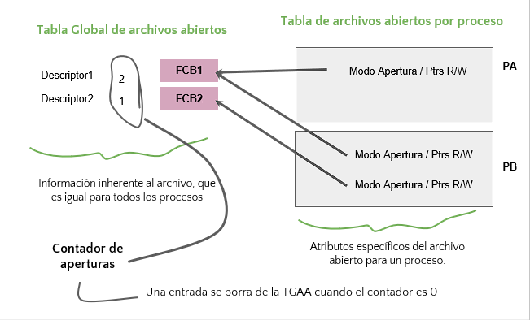

### Protección

- **Acceso total**: No se aplica ninguna estrategia de protección
- **Acceso prohibido**: Solo el propietario puede operar. El problema de este tipo de acceso es el cómo implementarlo, es complejo.
- **Acceso Controlado**: Indica quien puede operar y cómo. Lectura / Escritura / Ejecución / Adición / Borrado / Listado / etc, son operaciones que vamos a poder limitar

#### Implementaciones

- **Acceso total**: Se implementa “Propietario / Grupo / Universo”, ya que generalmente no se necesita saber todos los permisos de cada usuario, con que haya uno para el propietario, otro para el grupo, y otro para el universo, basta y sobra.
- **Acceso prohibido**: Matriz de acceso (usuario, recurso) -> permisos. Tiene mucha mayor granularidad pero desperdicia mucho espacio.
- **Acceso Controlado**: ACL (access control list): por cada archivo -> lista de los usuarios con sus permisos. Es más específico que el primer caso y ocupa menos espacio que el segundo. 

#### Protección en UNIX

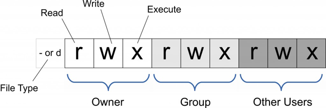

Los permisos tienen diferente significado según el type del archivo.

Con **type == d**
- Read -> ver el contenido del directorio == ls
- Write -> modificar el contenido del directorio == crear/eliminar archivos
- Execute -> posicionarse dentro del directorio == cd

**Ejemplos de cómo cambiar dichos permisos con chmod**

- Parcial, modificando únicamente lo que se indica:
`chmod 	g+w myfile //chmod  o-rw myfile // chmod  a-x myfile`
- Total, se modifican todos los permisos
`chmod 755 myfile -> setea  rwx r-x r-x (siendo r = 4 , w = 2 y x = 1)`

**¿Que pasa cuando Propietario/Grupo/Universo no alcanza?**

- Podría pasar que con el esquema de Propietario | Grupo | Resto no nos alcance para configurar los permisos adecuados en nuestra situación. 
- Para lo mismo, se puede combinar dicha estrategia con ACL en caso de ser necesario.

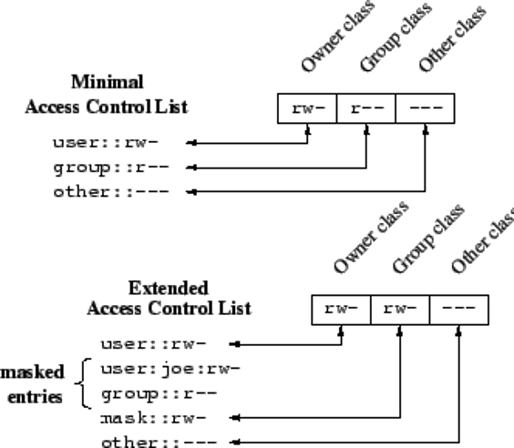

### Organización de los datos en el disco

Cuando uno instala Windows en realidad lo que está haciendo es, sobre la partición de un disco, formatear un volumen. Ese volumen va a tener una metadata y va a estar organizado de tal manera dependiendo del file-system que tenga el S.O, en el caso de Windows será NTFS, y en el caso de Linux será alguna variación de Xtend.

Una razón por la que podríamos hacer particionamiento es para tener más filesystems a
disposición.

En línea general, lo que guardamos en nuestras particiones son archivos. En Linux por
ejemplo, se trata a todo como un archivo.

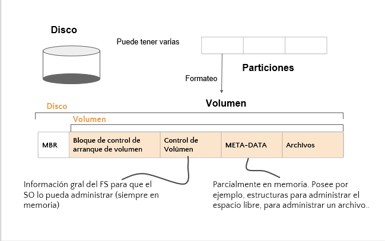

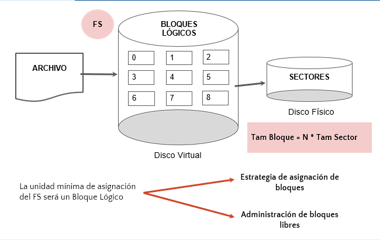

#### Asignación de bloques

Las particiones en disco siempre son fijas.

**Métodos de acceso a disco**:
- Secuencial: Se lee un registro después del otro.
- Directo: Se puede acceder a cualquier registro sin recorrer los anteriores.
- Indexado: Se coloca un índice para acelerar búsquedas sobre archivos grandes.
- Hashed: Para agilizar accesos directos. Se utiliza la función de hash para acceder directamente al bloque deseado

##### Contigua

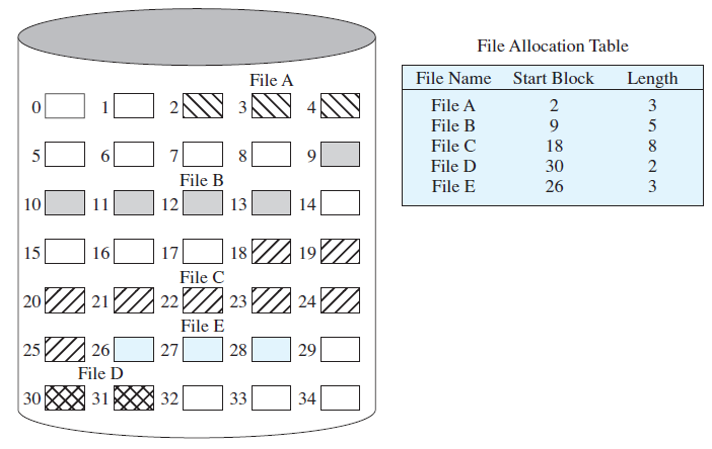

**Ventajas**:
- Los reposicionamientos del cabezal del disco son mínimos
- Se necesita poca información para administrar los espacios libres
- Es bueno para acceso directo y secuencial
- Lectura rápida, debido a que requiere menos reposicionamientos del cabezal (siempre que hablamos del cabezal nos vamos a referir al de los discos rígidos o también llamados HDD's) para escritura y lectura
- Si se daña un bloque no pierdo al resto

**Desventajas**:
- El tamaño se define en el momento de creación (Prealocación)
    - Más difícil encontrar un hueco libre
- Problemas para aumentar el tamaño del archivo
- Fragmentación externa. A medida que se asignan y borran archivos, el espacio libre del disco se descompone en pequeños fragmentos
- Sufre de fragmentación interna en el bloque final
- Se ocupa espacio de los bloques para guardar los punteros allí

##### Enlazada/Encadenada

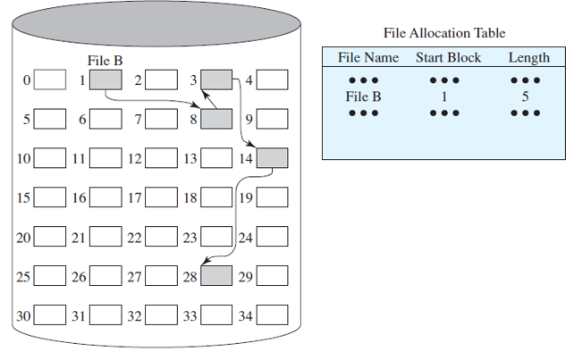

En vez de tener los bloques todos juntos, cada bloque tiene un puntero al final que me indica cuál es el próximo bloque, con lo cual solo necesito saber el bloque inicial. Esto me resuelve el problema de la fragmentación externa

**Ventajas**:
- No hay problemas para aumentar el tamaño del archivo (no hay prealocación)
- No presenta fragmentación externa
- Es bueno para acceso secuencial

**Desventajas**:
- Los reposicionamientos del cabezal del disco pueden ser mayores ( bloques dispersos )
- Es malo para acceso directo
- Espacio ocupado por ptrs -> se pueden usar clusters
- Corrupción de ptrs -> problema fiabilidad

##### Indexada

Para resolver el problema de la asignación enlazada, en vez de tener un puntero en cada bloque, puedo tener un bloque de punteros

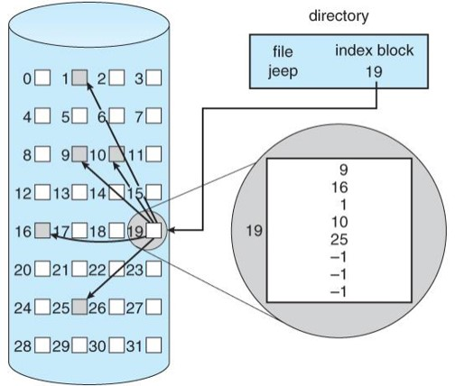

**Ventajas**:
- No hay problemas para aumentar el tamaño del archivo (no hay prealocación)
- No presenta fragmentación externa
- Es bueno para acceso secuencial y directo

**Desventajas**:
- Los reposicionamientos del cabezal del disco pueden ser mayores (bloques dispersos)
- Espacio ocupado por ptrs es aún mayor
- Corrupción de ptrs -> problema fiabilidad

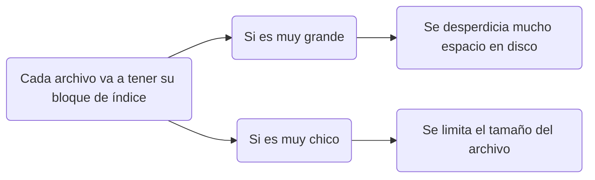

Lo que pasa con esta asignación, es que por un lado va a aumentar un poco la fragmentación interna, y por otro nos va a limitar severamente el tamaño de nuestros archivos. Para suerte nuestra, esto último se puede solucionar teniendo bloques de punteros multinivel:

- **Esquema enlazado**: Cada bloque de índice ocupa normalmente un bloque de disco -> puede leerse y escribirse directamente. Para que puedan existir archivos de gran tamaño, enlazamos varios bloques de índice.
- **Índice multinivel**: utilizar un bloque de índice de primer nivel para apuntar a un conjunto de bloques de índice de segundo nivel, que a su vez apuntarán a los bloques del archivo. 
- **Esquema combinado**: mantener los primeros N punteros del bloque de índice en el nodo del archivo siendo algunos ptrs a bloques de datos (BD) y otros a bloques de ptrs (BP)
    - Los archivos pequeños no necesitan un índice separado
    - Se pueden aún así referenciar a muchos bloques de datos, por lo que no se limita el tamaño del archivo.

#### Gestión de espacio libre

Generalmente usamos un bit vector que por cada bloque lógico tiene un bit que me dice si está libre o está ocupado.

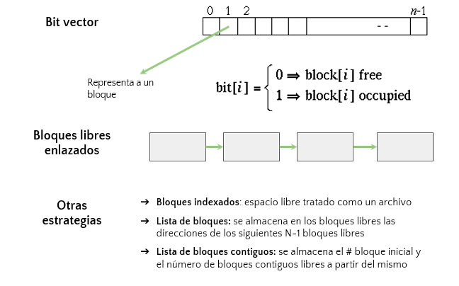

### Journaling

Para mantener la integridad de cada archivo utilizamos Journaling. ¿De que nos va a servir?

Bueno, básicamente si por ejemplo se nos apaga la PC mientras estamos escribiendo sobre un archivo (mientras realizo la OpA3), y no llegamos a commitear, cuando volvamos a encenderla, lo que va a ocurrir es que se va a generar el proceso inverso al que se vino haciendo, es decir, que si estábamos en la OpA3 y no llegamos a completarla, las operaciones OpA2 y OpA1 van a hacer el proceso inverso al que hicieron.

Si por ejemplo yo si llegué a commitear significa que quedé en un estado consistente, entonces cuando la PC se prenda de nuevo, no se va a generar el proceso inverso, sino que va a seguir con la OpB1.

- La información de las estructuras del FS por lo gral están más actualizadas en memoria que en disco
- Un fallo en el sistema / en el hw puede generar inconsistencias

### Archivos mapeados a memoria

Mapear un archivo en memoria, es básicamente agarrar ese archivo, y así como está dividido en bloques (por lo general de 4KB), mapearlo a páginas de 4KB, y de esa manera tomar todo ese archivo como si fuera espacio de SWAP. De esta manera cuando el proceso me pida utilizar dicho archivo, lo voy a swapear a memoria y va a ser mucho más veloz que tenerlo en disco y tener que hacer todo el procedimiento que vimos antes de archivos abiertos. 

Cuando se mapea un archivo se hace de cuenta que el archivo es parte de la memoria del proceso.

- Disminuye el overhead requerido por utilizar las syscalls read y write.
- Favorece el share de archivos entre procesos -> comparten páginas.
- Las escrituras no se realizan necesariamente sincrónicamente en disco

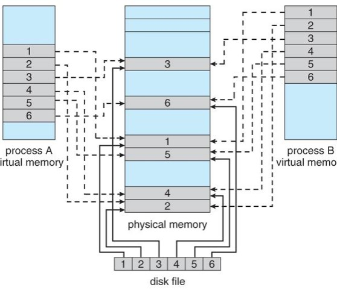

## FAT

FAT (File Allocation Table) es una implementación concreta de un file-system en particular que toma de base la [asignación enlazada](#enlazadaencadenada). Hoy en los sistemas operativos posta ya no se usa.

El problema de la asignación enlazada era que no había acceso directo, y que para dirigirte a un bloque especial, tenías que recurrir a un puntero, cuya locación estaba en disco, por lo cual era demasiado lento el proceso de ir a buscar dicho puntero para luego saber dónde se encontraba el bloque.

Por este motivo, para que no tengamos que usar los punteros ubicados en disco, los que implementaron FAT tomaron la decisión de agarrar todos esos punteros (de tamaño mucho menor a los bloques a los que apuntaban), y llevarlos a una tabla ubicada en memoria, la cual llamaremos “tabla FAT”.

Para implementar FAT lo que me interesa es saber el nombre del archivo y donde empieza, va a funcionar igual que la asignación encadenada con la diferencia de que ahora vamos a tener una tabla de punteros en memoria. Una entrada es el tamaño del puntero de la entrada FAT.

Como dato extra, si un cluster perteneciente a un archivo se daña y no puede ser leído, igual se puede recuperar el resto del archivo, independientemente de que exista o no una copia extra de la tabla FAT en otro lugar del volumen

- Variación de asignación encadenada: La FAT se guarda al inicio del File System y se copia a memoria para un acceso más veloz. Dada su importancia, se guarda una copia.
- Permite acceso directo
- Hay una entrada por bloque (cluster) de disco
- La entrada indica el bloque que le sigue (al bloque de dicho índice)
- No usa FCB. La información administrativa de los archivos se guarda en las entradas de directorio directamente.
- Para obtener un bloque libre se recorre la tabla.

### Volumen

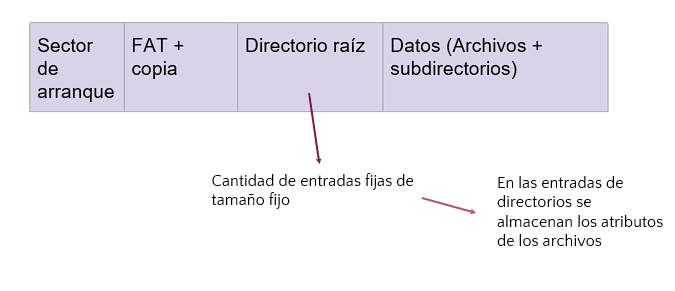

### Tamaño de entrada FAT

**FAT 12**
- Entradas de 12 bits
- Puede direccionar hasta 2^12 entradas

**FAT 16**
- Entradas de 16 bits
- Puede direccionar hasta 2^16 entradas

**FAT 32**
- Entradas de 32 bits
- Puede direccionar hasta 2^28 entradas
    - (si, 2^28, no 2^32) 
- El tamaño máximo de los archivos está limitado por la entrada de directorio (4GB máximo).

$$Tam FAT =  cantEntradas * tamEntrada$$

$$TamMáxTeórico Arch/FS = 2^{tamEntrada} * tamCluster$$

## EXT2

EXT es una implementación de un file-system de tipo Unix. Esta implementación se usa en los sistemas operativos actuales. Está basado en la [asignación indexada](#indexada).

EXT intenta resolver los dos problemas principales que tiene este tipo de asignación.

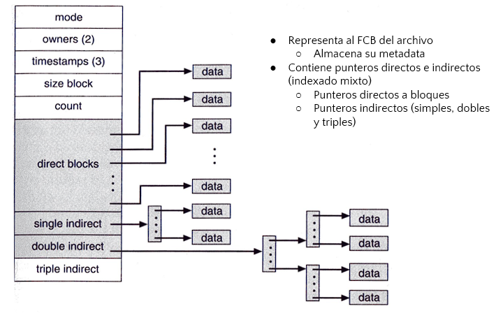

En EXT2 por ejemplo, el FCB es el inodo. Esto es así porque tiene toda la información relativa al archivo, y no pasa como pasaba en FAT en donde toda la información estaba en  las entradas de directorio. En este caso las entradas de directorio son mucho más chicas.

Más allá de la metadata que tiene el inodo, tiene punteros, ¿Cuántos tiene?, la implementación posta de EXT dice que tiene 12 punteros directos, 1 puntero indirecto simple, 1 puntero indirecto doble, y 1 puntero indirecto triple.

¿Qué quiere decir esto de directo e indirecto?

Bueno, los directos van a ser aquellos que apuntan a bloques de datos, en donde por ejemplo, si yo quisiera ir al primer bloque, voy a tener que utilizar el primer puntero.

Lo que pasa con el tema de los punteros directos es que si yo quisiera meter todo en el inodo, este pasaría a ser muy grande, además de que muchas veces no tiene sentido traer muchísima información a memoria. Por este motivo se crearon los punteros indirectos, que apuntan no a bloques de datos sino a bloques de punteros. En el caso del puntero indirecto simple, este va a contener un bloque de punteros en donde voy a poder apuntar a 4 direcciones. En el caso del puntero indirecto doble voy a poder apuntar a 16 direcciones, y en el caso del puntero indirecto triple a 64 direcciones.

Cada bloque de punteros va a ser del mismo tamaño que el bloque de datos, que por lo  general es de 4KB.

Cuando usamos punteros directos por lo general vamos a querer apuntar a archivos pequeños. El sentido de usar punteros indirectos es para los momentos en donde queramos apuntar a archivos muy grandes.

Para calcular el tamaño máximo de EXT 2, se usa esta cuenta:

$$PtrXBloque = TamBloque / TamPtr$$

$$TamMax = PtrXBloque^{nivelDeIndirección} * TamBloque$$

### Estructura en EXT2

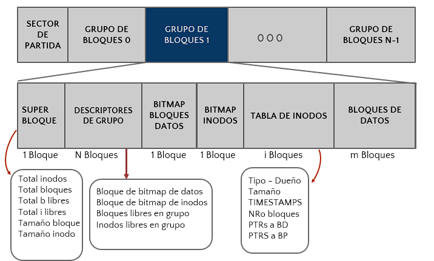

**Bloques de datos**: Al final de todo volumen se encuentra lo que son los bloques de datos, los lugares en donde uno guarda la información posta.

**Bitmap Bloques Datos**: En esta implementación no tenemos una tabla FAT, por lo cual necesitaremos de un bitmap para los bloques de datos, para saber si estos están ocupados o no.

**Tabla de inodos**: Por otro lado, vamos a tener una tabla de inodos, en donde, por ejemplo, dispondremos de 100 de ellos, en donde se va a poder destinar cada uno a un archivo distinto. Cabe aclarar que cuando nosotros creamos un archivo le asignamos un inodo, es decir, el inodo ya fue creado antes en el momento en que nosotros formateamos.

**Bitmap inodos**: Para administrar cuales inodos tengo ocupados y cuáles libres, se va a disponer del bitmap de inodos.

Para empezar a explicar lo que es el súper bloque, comencemos a hablar de que hace EXT: EXT no agarra y formatea todo como si fuera una gran cosa, sino que los separa en un grupo de bloques. En disco siempre va a pasar que tengamos ciertos grupos de bloques más cerca que otros (aclaremos que en file-system siempre nos vamos a referir a los discos rígidos), por lo cual cuando hagamos acceso a disco lo que vamos a buscar es no saltar de un lado a otro, de un grupo a otro, sino que vamos a tratar siempre de laburar en el mismo grupo de bloques, o a lo sumo en grupos continuos, con el fin de que el reposicionamiento de cabezales sea el mínimo (el reposicionamiento de cabezales surge cuando se va a buscar a una dirección u otra).

Si bien el grupo de bloques va a contener la información para que pueda administrar mi bloque, vamos a tener además al superbloque, que va a contener la información de todo el file-system, como por ejemplo cuántos inodos o bloques tengo en todo mi file-system, o cual es la configuración del tamaño del bloque o del tamaño del inodo. Además, del superbloque vamos a tener n copias, ¿con qué fin? Por un tema de seguridad y de velocidad. Cada grupo de bloques va a tener su propia copia del superbloque, para todos va a ser el mismo.

Por otro lado, evidentemente vamos a tener que  tener la información para gestionar nuestro grupo en particular, para lo cual vamos a tener nuestro descriptor de grupo, que va a contener lo escrito en el gráfico de arriba, en donde vemos, que el descriptor va a contener los punteros a la información.

### Directorios en EXT2

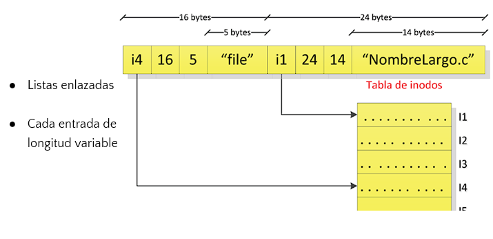

- Cuando nosotros hacemos por ejemplo un ls en consola, la información no la saca de las entradas del directorio, sino de los inodos.
- Los directorios de EXT son de longitud variable, mientras que los de FAT son fijos

### Softlinks

El archivo “acceso directo” es otro archivo totalmente distinto al original que lo único que contiene es el acceso directo al archivo posta. ¿Cómo sabemos que son archivos distintos?

Porque poseen inodos distintos, tienen distintos permisos, etc. La información que tiene el archivo de acceso directo es una ruta.

¿Y para qué nos sirve tener un archivo de acceso directo? Por la misma razón que le dábamos click al acceso directo del Counter Strike 1.6 en el escritorio, para tener que hacer menos accesos, es más rápido

### Hardlinks

Un hardlink es una referencia al mismo archivo. Lo que se hace es crear una nueva entrada de directorio que apunte al mismo inodo.

La diferencia con el softlink es que solo voy a tener un inodo, por lo cual no voy a poder distinguir cual es el original y cuál es el agregado, debido a que el nuevo va a tener el mismo inodo. Por esto mismo antes dijimos que el hardlink es básicamente un archivo regular. Si se borran ambas referencias (HL FILE LOCO y FILE LOCO), el archivo se borra, mientras que en el softlink no pasaba eso, debido a que el acceso directo solo contenía el path, y tenía un inodo distinto

### Resumen tipos de archivos
- Regular (-)
- Directorio (d)
- Links
    - Soft/Symbolic Links (|)
    - HardLinks (-)

### Creación de links

Hardlink

`ln fileloco hl_fileloco`

Softlink

`ln -s fileloco sl_fileloco`

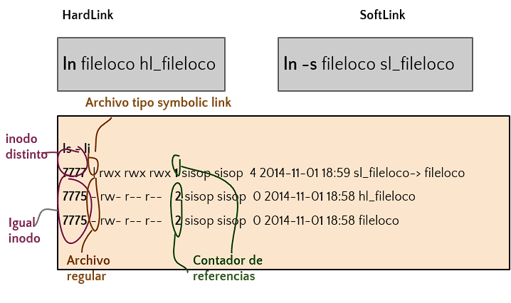
