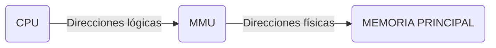

# Memoria

## Índice
- [Memoria Principal](#memoria-principal)
    - [Características](#características)
    - [Velocidad](#velocidad)
    - [Traducción de direcciones](#traducción-de-direcciones)
    - [Requerimientos del manejo de memoria](#requerimientos-del-manejo-de-memoria)
    - [Tipos de MMU](#tipos-de-mmu)
        - [Asignación continua](#asignación-continua)
        - [Asignación contigua - Particiones dinámicas](#asignación-contigua---particiones-dinámicas)
        - [Asignación contigua - Particiones fijas](#asignación-contigua---particiones-fijas)
            - [Algoritmos para la asignación de particiones](#algoritmos-para-la-asignación-de-particiones)
    - [Segmentación](#segmentación)
    - [Paginación (Simple)](#paginación-simple)
        - [Ventajas](#ventajas)
        - [De Dirección lógica a Dirección física](#de-dirección-lógica-a-dirección-física)
        - [¿Donde se aloca la tabla de páginas?](#donde-se-aloca-la-tabla-de-páginas)
            - [TLB (Translation Look-aside Buffer)](#tlb-translation-look-aside-buffer)
        - [Protección y compartir memoria entre procesos](#protección-y-compartir-memoria-entre-procesos)
        - [Estructura de tabla de páginas](#estructura-de-tabla-de-páginas)
        - [Paginación jerárquica](#paginación-jerárquica)
        - [Tabla de páginas invertida](#tabla-de-páginas-invertida)
            - [Ventajas](#ventajas-1)
            - [Desventajas](#desventajas)
        - [Tabla de páginas invertida con tabla de hash](#tabla-de-páginas-invertida-con-tabla-de-hash)
        - [Segmentación paginada](#segmentación-paginada)
    - [Comparación entre los algoritmos vistos](#comparación-entre-los-algoritmos-vistos)
- [Memoria Virtual](#memoria-virtual)
    - [Primeras soluciones](#primeras-soluciones)
    - [Solución actual](#solución-actual)
    - [Paginación bajo demanda](#paginación-bajo-demanda)
        - [¿Cómo sabemos si una página está cargada en memoria física?](#cómo-sabemos-si-una-página-está-cargada-en-memoria-física)
    - [Page Fault(PF)](#page-faultpf)
        - [¿Que hace el SO para atender ese PF?](#que-hace-el-so-para-atender-ese-pf)
        - [Proceso de traducción de dirección lógica a dirección física](#proceso-de-traducción-de-dirección-lógica-a-dirección-física)
        - [Asignación y sustitución de frames](#asignación-y-sustitución-de-frames)
            - [Políticas](#políticas)
            - [Combinaciones de los mismos](#combinaciones-de-los-mismos)
        - [Algoritmo de sustitución de páginas](#algoritmo-de-sustitución-de-páginas)
            - [FIFO](#fifo)
            - [Óptimo](#óptimo)
            - [LRU](#lru)
            - [Clock](#clock)
            - [Clock modificado](#clock-modificado)
        - [Thrashing](#thrashing)
            - [Conjunto de trabajo](#conjunto-de-trabajo)
            - [Bloqueo de páginas](#bloqueo-de-páginas)

## Memoria Principal

### Características

- Es un gran vector de bytes, que se corresponden a las direcciones (Cada byte es una dirección específica)
- Todas las instrucciones que se ejecutan y los datos sobre los que se operan tienen que estar en memoria principal (física o RAM)
- Hay un espacio denominado "Espacio Kernel" que está reservado para que el sistema operativo administre y pueda utilizar los procesos, después está el "Espacio usuario" que es el común para todos.
- Un programa debe cargarse en memoria desde disco y colocarse dentro de un proceso para que se ejecute.
- Por otro lado, la memoria principal y los registros son los únicos dispositivos de almacenamiento a los que puede acceder la CPU directamente.

### Velocidad

Diferencias de velocidad de acceso a los datos desde el SO a la memoria en específica, siendo la velocidad ascendente de izquierda a derecha

Disco $=>$ RAM $=>$ Cache $=>$ Registros

Generalmente, las direcciones de memoria son simbolicas a la hora de programar y declarar una variable por ejemplo, y a la hora de la compilación, pasan a ser direcciones reubicables para ya al final, el loader sea quien defina en que lugar de la memoria se va a ubicar, siendo ya una dirección absoluta.

En esta materia, se va a simplificar la idea, viendo que la reasignación de instrucciones puede darse en:
- **Tiempo de compilación:** Si se conoce a priori la posición que va a ocupar un proceso en la memoria se puede generar código absoluto con referencias absolutas a memoria; si cambia la posición del proceso hay que recompilar el código. Esta forma de reasignación es la más primitiva. El problema de esta está en que yo no puedo correr dos procesos a la vez si las direcciones a las que quieren acceder se pisan; una solución puede ser recompilar, lo cual es incomodísimo. Para mejorar esta situación surgió el tiempo de carga.
- **Tiempo de carga:** Si no se conoce la posición del proceso en memoria en tiempo de compilación se debe generar código reubicable
- **Tiempo de ejecución:** Si el proceso puede cambiar de posición durante su ejecución la vinculación se retrasa hasta el momento de ejecución. Necesita soporte hardware para el mapeo de direcciones (ej: registros base y límite). Esta reasignación es la más normal hoy en día, las anteriores no se utilizan

Un ejemplo de direcciones simbólicas traducidas en tiempo de compilación es lo que pasaba con los famosos cartuchos de SEGA, en donde la estructura de memoria del cartucho era siempre fija, y si se necesitaba recurrir a alguna dirección se iba directamente a ella sin más.

Es decir, si la dirección lógica del mapa era la 10, la dirección física iba a ser también la 10.

La diferencia con el tiempo de carga, es que por ejemplo, si nosotros le pidiéramos la dirección 10 como hicimos arriba, esta podría ir a buscarla a la dirección física 210, es decir, lo que estaría contando en este caso es el desplazamiento de 200, pero al fin y al cabo el concepto sigue siendo el mismo.

### Traducción de direcciones

|Momento en que se da|Resultado|
|-|-|
|En tiempo de compilación| DL == DF |
|En tiempo de carga| DL == DF |
|En tiempo de ejecución| DL != DF|

La MMU (Unidad de Administración de Memoria) es un componente de hardware que lo que hace es básicamente leer las direcciones lógicas y traducirlas a físicas para poder ir a buscarlas a la memoria principal.
La traducción en tiempo de ejecución se diferencia de las demás porque cuando la MMU reciba la dirección lógica, irá a buscar una dirección física distinta, y no igual como pasa en compilación o carga.

### Requerimientos del manejo de memoria

Se debe satisfacer:

- **Realocación:** Un buen manejo de memoria debería permitir la realocación en cualquier momento, no tener un lugar fíjo en memoria. Un proceso debería poder cambiar de posición en memoria y funcionar de todas maneras.
- **Protección y compartir memoria:** Un proceso no debería poder accerder al espacio de direcciones de otro... Sin su permiso (A través de las syscalls correspondientes).
- **Organización lógica:** Segmentación y paginación. Como los procesos acceden a la memoria
- **Organización física:** Cómo se almacena realmente la memoria

### Tipos de MMU

#### Asignación continua

En un modelo de memoria con asignación contigua, todo el espacio lógico de un proceso (Código, Datos, Pila) ha de estar ubicado de forma contigua en memoria principal, es decir en direcciones físicas consecutivas

$DF = Base + DL$ 

Sólo si $DL < Límite$

Por ejemplo, yo le doy a mi proceso P1 una base P1 física y un límite que va a estar definido por el tamaño de ese proceso (200MB por ej). Si el proceso quiere leer una variable cuya dirección lógica va a ser 10 por ejemplo, la MMU va a buscar esa dirección y traducirla a física sumándole la base.
La asignación contigua hace que el manejo de la memoria sea más simple pero más ineficiente y restrictivo:

- Si en el hipotético caso de que el proceso P1 me pidiera más memoria, tendría que mover todos los procesos contiguos a él, tendría que reescribir todo.
- Si quisiera compartir memoria también sería otro problema, ya que tendría que pasar que por ejemplo el P1 y el P2 se solapen, y que la última dirección de P1 comparta la misma locación en memoria que las primeras direcciones de P2. Si yo sumara la base de P1 más su límite, ya estaría tocando la base de P2.

#### Asignación contigua - Particiones dinámicas

- El tamaño de la partición es igual al tamaño requerido por el proceso, se define en el momento de carga.
- No se limita la cantidad de procesos en memoria.
- No hay fragmentación interna

Cuando no hay suficiente memoria contigua, se lo denomina **fragmentación externa**

**¿Y cómo se soluciona?**

Con **compactación**, pero ¿Siempre es posible? No, solo cuando dos particiones adyacentes se liberan, las mismas se unen (CONSOLIDAN) en una partición más grande.

En las particiones dinámicas vamos a tomar todos esos pedacitos de memoria con el fin de compactarlos todos contiguos para posteriormente asignarle esa partición al PD, en este caso.

A pesar de que solucione el problema, está a la vista que pueden llegar a surgir problemas como vimos anteriormente, como por ejemplo el solapamiento de procesos.

La compactación es una tarea que dura bastante en realizarse.

#### Asignación contigua - Particiones fijas

En vez de asignarle a mi proceso una base custom, podría agarrarlo y meterlo en una partición fija, sabiendo que no va a poder solaparse con otros procesos.

Al utilizar particiones fijas es muy importante definir un tamaño de partición adecuado.

Todas las particiones fijas son del mismo tamaño.

- Inicialmente se definen N particiones de tamaño fijo
- Un proceso no podrá ser más grande que el tamaño de la partición
- No podrán haber en memoria física más de N procesos simultáneamente
- Cualquier partición liberada puede ser utilizada para cualquier otro proceso

Un problema de las particiones fijas es la fragmentación interna, ¿y por qué este nombre?, porque se produce dentro de un espacio fijo o ya asignado. Este problema podría darse si yo tengo un proceso muy chiquito que podría entrar dentro de la partición que se le fijó al PB, pero nunca va a poder darse porque ese espacio de memoria, aunque no se utilice, ya está reservado para PB.

##### Algoritmos para la asignación de particiones

- **Primer ajuste o First Fit:** El primer hueco en el que entre
- **Siguiente ajuste o Next Fit:** El primer hueco en el que entre partiendo desde la útima asignación
- **Mejor ajuste o Best Fit:** El hueco más pequeño en el que entre
- **Peor ajuste o Worst Fit:** El hueco más grande en el que entre

### Segmentación

Soporta la visión que tiene el “usuario” del programa
- Segmento de Código (CS)
- Segmento de Datos (DS)
- Segmento de Pila (SS)

Los segmentos asignados con de tamaño variable, ajustándose al tamaño requerido
- Sufre de **fragmentación externa** pero no interna
- Cada segmento se almacena en forma contigua en memoria principal
- Cada segmento puede presentar distintos permisos (R, W , X)

La dirección lógica está compuesta por:
$$NRO SEGMENTO + OFFSET$$

### Paginación (Simple)

La paginación simple es un caso especial de partición fija.

La idea de la paginación es dividir tanto la memoria principal en particiones fijas chicas, todas del mismo tamaño, denominadas ***marcos*** o ***frames***, como también a los procesos en páginas del mismo tamaño (si los marcos son de 4KB, entonces las páginas también). Con esto lo que tratamos de hacer es que la asignación no sea contigüa.

#### Ventajas

- Permite que el espacio de direcciones físicas no sea contiguo
- Divido los procesos en páginas y a la memoria principal en frames 
- Cualquier marco puede ser asignado a cualquier página
    - No genera fragmentación externa
- Las páginas y marcos son de tamaño fijo
    - Genera fragmentación interna (en la última pág)
- Cada proceso tiene una **tabla de páginas** indicando en qué **marco** se encuentra cada página
- Cada página posee un bit de **VALIDEZ** lo que indica si dicha página se encuentra dentro del espacio de direcciones del proceso.
- Una forma de administrar los marcos libres es con un bitmap

**Ejemplo**

Bitmap de marcos libres:
|1|1|1|1|1|1|1|0|1|1|0|
|-|-|-|-|-|-|-|-|-|-|-|
   
Tabla de páginas PA:

||Marco|V|
|-|-|-|
|0|5|1|
|1|6|1|
|2|2|1|
|3|-|0|
|4|-|0|
|5|-|0|

#### De Dirección lógica a Dirección física

Antes que nada, debo saber cúal es la página para obtener el marco. Se consigue mediante esta fórmula:

$$DL / TamPag = NroPag$$$$Offset = Resto$$

Con el número de página, buscamos en la tabla de páginas el marco en donde está y de ahí derivamos a que:

$$DF = NroMarco*TamañoMarco + offset$$

Siendo el tamaño del marco igual al tamaño de la página.

**Ejemplo**

TamPág: 1KiB
DL -> 2045(decimal)

Tabla de páginas PA:
||Marco|V|
|-|-|-|
|0|5|1|
|1|6|1|
|2|2|1|
|3|-|0|
|4|-|0|
|5|-|0|

$NroPag = 2045 /1024 = 1$
$Offset = 1021$

$DF = 6 * 1024 + 1021 = 7165$

**Otra forma de resolverlo**

Como la página es de 1KiB $=>$ necesito 10 bits para direccionar un byte dentro de la misma (Ya que $1KiB =$ $2^{10}$), debo saber cúal es la página para obtener el marco:

$2045(d) = 11111111101(b)$

Como el tamaño de página es de 1KiB, recorremos de derecha a izquierda y cortamos al encontrar el bit nro 10

$NroPag <- 1|1111111101 -> offset$

La pág es 1, por lo que su marco correspondiente es $6 = 110(b)$

|Nro Marco|Offset dentro de Pag (10 bits)|
|-|-|
|110|1111111101|

$1101111111101(b) = 7165(d)$

#### ¿Donde se aloca la tabla de páginas?

Si la MMU tuviera una tabla con todas las páginas y los marcos de cada proceso, pesaría demasiado, y eso requeriría de un hardware demasiado costoso. Por este motivo, normalmente las tablas de páginas de cada proceso se encuentran en la RAM.

El PTBR contiene el puntero de la tabla de páginas del proceso en ejecución. En los cambios de proceso, se debe guardar en el PCB.

Cada vez que nosotros queramos hacer una traducción nos va a inferir 2 accesos a memoria, una porque tengo que acceder primero a la tabla de páginas del proceso que se encuentra en la RAM, y otra porque con esa información recién voy a saber a dónde ir a otra vez a RAM pero para encontrar el dato que me pidieron.

¿Y cómo accedemos a la tabla de página de cada proceso? Bien, accediendo al PCB de cada proceso, el cual posee el puntero a la tabla de página correspondiente.

##### TLB (Translation Look-aside Buffer)

- Es una memoria asociativa de alta velocidad (caché HW)
- Guardamos entradas de la tabla de página para agilizar el proceso de traducción y el acceso efectivo a memoria

Puede además guardar en cada entrada un identificador del proceso:	
- Por protección de otros procesos
- Para no tener que vaciar la caché al cambiar de proceso

Si la TLB tiene una columna extra donde se puede diferenciar los procesos y sus respectivas páginas, entonces podría tener páginas de distintos procesos cargados en la TLB sin problema. Si no existiera esa columna, a la hora de hacer un cambio de procesos, debería cambiar toda la TLB ya que la que existía ya no es cierta.

Con esto se ve que cambiar de proceso es, o suele ser, más costoso que cambiar de KLT de un mismo proceso, ya que en este último caso, el puntero a la tabla de páginas del proceso es el mismo y la tabla de páginas sigue siendo la misma.

Siempre es conveniente tener una TLB aunque la tasa de acierto sea baja ya que, como es caché contra memoria, podemos estimar una relación 1000-1 en velocidad, por lo que siempre es conveniente. Lo podemos calcular con esta cuenta

$$Tacceso−Tefectivo = Pacierto ∗ Tacierto + Pfallo ∗ Tfallo$$

#### Protección y compartir memoria entre procesos

> **Protección:** Se pueden agregar bits en la TP para indicar permisos sobre las páginas

> **Memoria compartida:** se logra apuntando a los mismos marcos

La forma de compartir memoria va a lograrse cuando haya páginas que compartan el mismo marco.  Dichas páginas van a tener el mismo contenido, o bien van a poder compartir el mismo.

#### Estructura de tabla de páginas

Si las direcciones son de 32 bits y las páginas son de 1 KiB (2^10) la tabla de páginas puede tener 2^32 / 2^10 = 2^22 entradas.

Si cada entrada es de (al menos) 4 bytes, entonces una tabla de páginas puede ocupar 16 MiB.

=> 16 MiB contiguos en memoria principal...

¿Y si las direcciones son de 64 bits?...

¿Con qué problema nos encontramos acá? Que si yo tengo procesos muy grandes, cada tabla de páginas para cada proceso estarían ocupando una locura de espacio, tan solo con el ejemplo chiquito de arriba pudimos ver que una sola tabla de páginas puede ocupar 16MB.

Por este motivo, lo que se usa es la **paginación jerárquica, o multinivel**:

#### Paginación jerárquica

Paginar la tabla de páginas -> puedo tenerlo disperso en memoria (en los niveles que requiera)

Con la paginación jerárquica, yo voy a poder paginar a su vez la tabla de páginas. El sentido de esto es tener una tabla de páginas de primer nivel que me diga a su vez donde van a estar el resto de tablas de páginas de ese proceso.

La gracia de esto es que si yo tengo por ejemplo, un proceso chiquito que solamente necesite una tabla de páginas chiquita, va a usar solamente la tabla de páginas de primer nivel y la de segundo nivel, mientras que las demás tablas de páginas m van a quedar solo para los procesos que la necesiten, de esta manera vamos a lograr que no todas las tablas de páginas pesen 16MB siguiendo el ejemplo anterior.

En la paginación jerárquica van a ocurrir 3 accesos a memoria: primero porque voy a tener que ir a la tabla de páginas de primer nivel, segundo porque voy a tener que ir al cachit o de tabla de páginas del segundo nivel que contiene la página a la que quiero acceder, y por último para ir al dato que estoy buscando.

Si tenemos la TLB para los casos recurrentes, los accesos se reducen a 1.

#### Tabla de páginas invertida

- Es una estructura de tabla de páginas que ocupa menos espacio que las tablas de páginas tradicionales
- Hay una tabla para todo el sistema (en lugar de una tabla por proceso)
- Está indexado por marco (frame) en lugar de por página (hay tantas entradas como marcos en la memoria física)
- El valor almacenado me dice qué página de qué proceso se encuentra en dicho marco

Una tabla de páginas invertida es mucho más lenta, por el hecho de que si tengo que ir a buscar una página X, voy a tener que ir ‘preguntándole’ a cada frame si contiene dicha página para poder entrar a ella.

##### Ventajas

- Ocupa menos espacio que el resto de las estructuras de tabla de páginas

##### Desventajas

- Tengo que hacer una búsqueda lineal para encontrar el marco, aunque esto se puede mejorar con una tabla hash
- Difícil para compartir memoria
- Difícil de implementar Memoria Virtual

#### Tabla de páginas invertida con tabla de hash

La idea de usar una función de hash, es acortar el tiempo de ir a buscar la página que quiero fijándome en que marco está. Sin hash nosotros empezamos a buscar desde 0, no tenemos un punto de
partida, nos vamos fijando en cada marco.

Lo que sucede usando una función de hash es que yo le voy a pasar por parámetro el PID del proceso y la página, devolviéndome la función un número de marco; entonces cuando vuelva de nuevo el proceso y me pida la página, yo voy a poner los mismos parámetros y me va a tener que devolver el mismo valor.

Si bien con esta alternativa se pueden generar colisiones, aun así mi búsqueda va a tener un mejor punto de partida.

#### Segmentación paginada

Nosotros vamos a querer que la memoria esté dividida en marcos, que pueda agarrar cualquier página de un proceso y ponerla en cualquier marco, queremos compartir memoria, pero al mismo tiempo no quiero tener tanta granularidad con el tema seguridad, y quiero tener al proceso dividido en segmentos que tengan sentido, que yo sepa si son cachos de código (CS) o no.

La idea de la segmentación paginada va a ser segmentar al proceso en segmentos de código, pila o datos, los cuales van a tener los bits de protección de lectura, escritura, etc. Una vez segmentado el proceso, voy a darle a cada segmento una tabla de páginas.

De esta manera yo voy a saber por ejemplo, si cada página es de código o no, o si es de datos o no.

Con la segmentación paginada, puede que llegue a tener un poco de fragmentación interna, pero no voy a tener fragmentación externa.

### Comparación entre los algoritmos vistos

|Técnica|Descripción|Ventajas|Desventajas|
|-|-|-|-|
|**Particiones fijas (asign. contigua)**|La memoria se divide en particiones de tamaño fijo. El proceso debe ser de menor o igual tamaño.|Simple de implementar. Poco overhead.|Fragmentación interna. Se limita el grado de multiprogramación.|
|**Particiones dinámicas (asign. contigua)**|La partición se crea del tamaño exacto del proceso.|Se usa la memoria más eficientemente.|Fragmentación externa (necesitamos compactación).|
|**Segmentación**|El proceso se divide en segmentos de diferente tamaño.|No hay fragmentación interna. No necesitan estar contiguos entre sí.|Fragmentación externa.|
|**Paginación**|La memoria se divide en frames de tamaño fijo. Los procesos se dividen en páginas de igual tamaño (igual al frame).|No hay fragmentación externa. No necesitan estar contiguas entre sí.|Fragmentación interna en la última página. Más estructuras administrativas.|

## Memoria Virtual

Anteriormente en la parte de planificación, dijimos que un proceso tenía que estar entero para que se pudiera ejecutar, o estaba todo entero o estaba swapeado a RAM, era una o la otra.

El problema que trae esto, es que limitamos el tamaño máximo del proceso, límite que pone la RAM, es decir, que si hay un proceso enorme cuyo tamaño la RAM no se banca, no lo puede ejecutar.

Por otro lado, limitamos un poco también el tamaño de multiprogramación. Si tenemos un proceso de 4GB que para ejecutarse necesita de 1GB, estamos ocupando 3GB de memoria que tranquilamente podrían ser usados para poder cargar otros procesos.

Ante este problema, surgieron soluciones.

### Primeras soluciones

Las primeras soluciones vinieron del lado del programador, debido a que hace tiempo, antes de que el S.O soporte este problema, no había un soporte para solucionar esto.

La sección principal es el código fundamental de un proceso que tiene que estar siempre ejecutando. En este proceso A de ejemplo vemos algo llamado overlay driver, que básicamente va a ser el que va a administrar a los demás overlays.

Los overlays son parte del código del proceso que no necesariamente hacen falta que se ejecuten para que el proceso se pueda ejecutar, para esto último solo necesitamos la sección principal.

Para bajarlo a tierra podemos pensar como el overlay 1 forma parte de la inicialización del proceso y el overlay 4 se basa en manejo de errores (que si en la ejecución del proceso no llegara a fallar nada, este overlay nunca sería enviado a RAM para ejecutarse). La idea es ir cargando y descargando en RAM las partes del código del proceso que tengan sentido.

### Solución actual

La verdad es que la solución actual es otra. Actualmente toda esa parte que antes se hacía a mano, en donde se le mentía al S.O haciéndole creer que un proceso se podía ejecutar sin estar entero en memoria, ahora nos lo soluciona automáticamente el sistema operativo, y entra en juego la memoria virtual.

El sistema operativo lo que va a hacer es mentirle al proceso, le va a decir que puede referenciar todas las direcciones que quiera, aun no teniendo todas las direcciones cargadas en memoria principal.

¿Y qué pasa si una dirección a la que quiere referenciar no está en memoria? Bueno, básicamente lo que va a hacer el S.O es decirle al proceso que espere (bloquearlo), va a traer esa dirección a memoria, y luego le va a decir al proceso que está todo ok. Que una dirección tenga que estar en memoria para ejecutar se debe a que toda instrucción debe estar en memoria para poder ejecutarse, por cómo funciona la CPU.

**Las referencias a memoria dentro de un proceso son DL que pueden ser traducidas a DF en tiempo de ejecución**
- Puede estar cargado en diferentes partes según el momento
- Puede estar en MP o en disco (swap)

**Un proceso puede dividirse en “partes” que no tienen por qué estar contiguas en MP**

- Al no tener cargado procesos en memoria que no se necesiten, aumentamos el grado de multiprogramación
- Permitimos procesos más grandes ya que la memoria ya no es una limitación.
- También es más transparente para el programador ya que no necesitaría hacer más overlaying (que no significa que no pueda hacerlo).

### Paginación bajo demanda

- Las páginas se cargan a memoria física sólo cuando se necesita
- El swapping es “lazy” : en vez de mover un proceso entero entre MP y SWAP se mueven páginas.
- El tiempo de carga de los procesos disminuye ya que lo único que tenemos que traer de dichos procesos para que puedan ejecutar es el PCB.

Siempre que se habla de memoria virtual, generalmente se va a hablar de paginación.

Las páginas en memoria virtual generalmente van a ser de 4KB, básicamente porque es el tamaño justo para no tener que estar trayendo y llevando mucha información.

#### ¿Cómo sabemos si una página está cargada en memoria física?

Como teníamos antes el bit de validez, ahora tenemos el bit de presencia.

|N°Pag|Frame|P(Presencia)|M(Modificado)|
|-|-|-|-|
|0|-|0|0|
|1|2|0|0|
|2|7|1|1|
|3|2|1|0|

- Si el bit está en 0, es porque esa página no está cargada en MP.
- Si tiene un número de frame asignado pero el bit de presencia está en 0, no me interesa esa información, porque quiere decir que en algún momento se cargó pero lo reemplacé por X motivo.
- Tenemos también el bit de modificado que, si está en 1, solo me indica que una página que está cargada en MP, fue modificada durante su ejecución y los cambios que se hicieron no se guardaron en SWAP

Muy bien hasta ahora pero... ¿Que pasa si quiero referenciar a una página que no está en memoria principal? Se ejecuta una excepción llamada Page Fault (PF).

### Page Fault(PF)

#### ¿Que hace el SO para atender ese PF?

1. Comprobar si la dirección es **válida o inválida** para dicho proceso. Nos preguntamos, ¿Está dentro del espacio de direcciones del mismo?

2. Si la referencia es **inválida** hay dos opciones. 
    - Se finaliza el proceso.
    - Se envía algún mensaje de error para que lo maneje y tal vez siga con la siguiente referencia a memoria.

3. Si la referencia es **válida** hay que cargar la página a MP
    - Se dispara una orden de lectura en disco para leer la página deseada y cargarla en el marco seleccionado (puede no haber ningún marco libre, por lo que habría que [desalojar](#algoritmo-de-sustitución-de-páginas) uno).
    - Cuando se completa la lectura de disco, se modifica la tabla de páginas para indicar que la página ahora se encuentra en memoria -> P = 1
    - Se reinicia la instrucción que causó la interrupción

#### Proceso de traducción de dirección lógica a dirección física

1. La CPU ejecuta una instrucción que referencia a una página, por lo que la MMU busca en la TLB. 
    - Si hace un TLB hit, listo, ya tengo la **dirección física** (hice solo un acceso a memoria).
    - Por el contrario, con un TLB miss, vamos al punto 2.
2. La MMU busca en la tabla de páginas (acceso a memoria extra).
    - Si el bit de presencia es 1, se agregará la entrada a la TLB, y la **dirección física** ya la tengo.
    - Si el bit de presencia es 0, la CPU lanzará una excepción (Page Fault), la cual el SO la va a atender. Lo vemos en el punto 3.
3. Se atiende la excepción por el SO.
    - Caso excepcional. Si la dirección lógica está fuera del espacio de direcciones, se devuelve **error o finaliza el proceso**.
    - Si la página es válida (está en SWAP), busco asegurarme que haya un frame libre para colocar la página (busco que en el Bitmap haya un frame libre, me da igual cual). Lo vemos en el punto 4.
4. Busco un frame libre.
    - Si hay uno disponible, se dispara la operación de lectura (asumimos que estamos usando DMA) y se marca el frame como ocupado (en el bitmap aviso que ese frame ya está ocupado). Una vez que tengo la información cargada se marca esa página como presente (bit de presencia = 1) y la MMU agrega a la TLB para que me quede actualizada. De ahí, se vuelve a ejecutar la instrucción (El program counter sigue en la misma posición y volvemos al punto 1.)
    - Si no hay uno disponible, se elige un frame *víctima*, por lo que emplearemos algún [algoritmo + política de sustición de páginas](#asignación-y-sustitución-de-frames) que nos van a decir cuál es una buena víctima para sacarle el frame y con cuál criterio lo voy a sacar, cuál es el más apropiado para sacar. Esta víctima va a ser la que probablemente menos se vaya a referenciar a posteriori. De acá vamos al punto 5.
5. Una vez seleccionada la *víctima*, vemos como está el bit de modificado.
    - Si el frame de víctima que elijo no tiene nada modificado (M = 0), el S.O va a marcar el frame como libre y le va a avisar a la página del proceso que se estaba ejecutando que su presencia va a pasar a ser 0, debido a la quita del frame (un solo acceso a disco). 
    - Por otro lado, si el frame de víctima que elijo tiene algo que estaba modificado (M = 1), es decir que fue modificado en runtime, lo cual es muy raro porque por lo general no se va a modificar, se va a tener que disparar una operación de escritura para escribir en SWAP toda la página (lo cual lleva tiempo y también se hace el proceso de traducción de dirección lógica a física completa). Pongo el M = 0 y la P = 0, para a posteriori hacer lo mismo que hicimos cuando el bit de modificado era igual a 0 (son dos accesos a disco).

Cabe recalcar de este último ítem, que siempre se va a querer optar por el camino del frame no modificado, el camino más corto, ya que disparar una operación de escritura consume más tiempo. El algoritmo que usemos siempre va a tratar de elegir un frame que no haya sido modificado.

#### Asignación y sustitución de frames

##### Políticas

- **Asignación** 
    - Fija $=>$ un proceso siempre tiene asignado un número fijo de frames
    - Dinámica $=>$ el número de frames que tiene asignado un proceso puede aumentar o disminuir

- **Sustitución** 
    - Local $=>$ las *víctimas* a elegir deben estar dentro del conjunto de frames asignados al proceso
    - Global $=>$ se puede elegir como *víctima* cualquier frame (puede ser de otro proceso)

##### Combinaciones de los mismos

||Local|Global|
|-|-|-|
|**Fija**|Approved|Sos un terrorista|
|**Dinamica**|Approved|Approved|

- **Local Fija**: Las víctimas a elegir van a estar dentro del conjunto de número fijo de frames de un proceso
- **Local Dinámica**: Las víctimas a elegir van a estar dentro del conjunto de número dinámico de frames de un proceso
- **Global Dinámica**: Cualquier frame de cualquier proceso puede ser elegido como víctima
- **Global Fija**: Esta combinación no tiene sentido, ya que si yo le robo un frame a un proceso hago que este decrezca y que el “ladrón” crezca, entonces ya no sería fija, es un absurdo.

#### Algoritmo de sustitución de páginas

- Cada vez que ocurre un PF habrá una operación de carga de página (se lee la página faltante de disco y se carga en memoria) y tal vez una descarga (se escribe el contenido del marco víctima en disco)
- Para analizar los diferentes algoritmos tomaremos una secuencia de referencias y compararemos la cantidad de PFs que generan:

$$2 - 3 - 2 - 1 - 5 - 2 - 4 - 5 - 3 - 2 - 5 - 2$$

- Lo que nos va a interesar de las referencias son los números de página
- Siempre se va a esperar que si se asignan más frames, ante una misma secuencia, se generen igual o menos PFs
    - Algunos algoritmos ante determinadas secuencias de referencias al aumentar el número de frames sin embargo incrementan la frecuencia de PFs $=>$ **Anomalía de Belady**

##### FIFO

- Elige como víctima a la página que está cargada en memoria hace más tiempo
- Se puede implementar
    - Guardando el instante en el que la página fue cargada -> se elige la que tiene el menor valor
    - Cola FIFO -> se elige la página que primero se agregó a la misma
- Sufre de la Anomalía de Belady

|Cadena|2|*3'*|2|1|*5'*|2|*4'*|5|3|*2'*|5|2|Total|
|-|-|-|-|-|-|-|-|-|-|-|-|-|-|
|1°Frame|2|2|2|2|5'|5'|5'|5'|3|3|3|3|
|2°Frame|-|3'|3'|3'|3'|2|2|2|2|2'|5|5||
|3°Frame|-|-|-|1|1|1|4'|4'|4'|4'|4'|2||
|PFs|PF|PF|-|PF|PF|PF|PF|-|PF|-|PF|PF|9 PF|
|Accesos a Disco|1|1|0|1|1|2|1|0|2|0|2|2|13 A|

##### Óptimo

- Elige como víctima a la página que no vaya a ser referenciada por un mayor período de tiempo
- Genera la mínima tasa de PFs posibles
- No sufre de la Anomalía de Belady
- Se utiliza a fines comparativos $=>$ se puede saber cuántos más PFs genera otro algoritmo comparado al Óptimo

|Cadena|2|*3'*|2|1|*5'*|2|*4'*|5|3|*2'*|5|2|Total|
|-|-|-|-|-|-|-|-|-|-|-|-|-|-|
|1°Frame|2|2|2|2|2|2|4|4|4|4|4|4|
|2°Frame|-|3'|3'|3'|3'|3'|3'|3'|3'|2'|2'|2'||
|3°Frame|-|-|-|1|5'|5'|5'|5'|5'|5'|5'|5'||
|PFs|PF|PF|-|PF|PF|-|PF|-|-|PF|-|-|6 PF|
|Accesos a Disco|1|1|0|1|1|0|1|0|0|2|0|0|7 A|

##### LRU

- Elige como víctima a la página menos recientemente utilizada (hace más tiempo que no se referencia) -> utiliza el pasado reciente como una aproximación del futuro
- Se puede implementar:
    - Guardando el instante de última referencia de cada página -> se elige al que tiene el menor valor
    - Pila con números de págs $=>$ con cada referencia se coloca la pág superior, se elige como víctima la pág de la parte inferior
- No sufre de la Anomalía de Belady
- Más overhead que los algoritmos que vimos, pero tampoco tanto.

|Cadena|2|*3'*|2|1|*5'*|2|*4'*|5|3|*2'*|5|2|Total|
|-|-|-|-|-|-|-|-|-|-|-|-|-|-|
|1°Frame|2|2|2|2|2|2|2|2|3|3|3|3|
|2°Frame|-|3'|3'|3'|5'|5'|5'|5'|5'|5'|5'|5'||
|3°Frame|-|-|-|1|1|1|4'|4'|4'|2'|2'|2'||
|PFs|PF|PF|-|PF|PF|-|PF|-|PF|PF|-|-|7 PF|
|Accesos a Disco|1|1|0|1|2|0|1|0|1|2|0|0|9 A|

##### Clock

- Está basado en FIFO, con un bit de referencia (Bit de Uso) trata de aproximar el algoritmo LRU
- Un puntero indica cuál es la siguiente posible víctima (la cola es circular)
- Primero se mira el **bit de uso**
    - Si U  = 0 -> es la víctima -> se reemplaza y se avanza el puntero
    - Si U = 1 -> Se le da una oportunidad 
        - Se pone U en 0
        - Se avanza el puntero

|Cadena|2|*3'*|2|1|*5'*|2|*4'*|5|3|*2'*|5|2|Total|
|-|-|-|-|-|-|-|-|-|-|-|-|-|-|
|Bits|P U|P U|P U|P U|P U|P U|P U|P U|P U|P U|P U|P U||
|1°Frame|**2 1**|**2 1**|**2 1**|**2 1**|5' 1|5' 1|**5 1**|**5 1**|3 1|3 1|**3 1**|**3 1**|
|2°Frame|-|3' 1|3' 1|3' 1|**3 0**|2 1|2 1|2 1|**2 0**|**2' 1**|2 0|2 1||
|3°Frame|-|-|-|1 1|1 0|**1 0**|4' 1|4' 1|4' 0|4 0|5 1|5 1||
|PFs|PF|PF|-|PF|PF|PF|PF|-|PF|-|PF|-|8 PF|
|Accesos a Disco|1|1|0|1|1|2|1|0|2|0|2|0|11 A|

##### Clock modificado

- Tiene en cuenta además del bit de Uso, al bit de Modificado
- Trata de minimizar las descargas de páginas a disco
- Teniendo al par (U , M)
    a. Se busca (0,0) avanzando el puntero pero sin poner U en 0
    b. Si no se encuentra, se busca (0 , 1) avanzando el puntero poniendo U en 0
    c. Si no se encuentra, se vuelve al paso a.

|Cadena|2|*3'*|2|1|*5'*|2|*4'*|5|3|*2'*|5|2|Total|
|-|-|-|-|-|-|-|-|-|-|-|-|-|-|
|Bits|P U M|P U M|P U M|P U M|P U M|P U M|P U M|P U M|P U M|P U M|P U M|P U M||
|1°Frame|**2 1 0**|**2 1 0**|**2 1 0**|**2 1 0**|5' 1 1|**5' 1 1**|5 0 1|5 1 1|**5 0 1**|2 1 1|2 1 1|2 1 1|
|2°Frame|-|3' 1 1|3' 1 1|3' 1 1|**3' 0 1**|3 0 1|4' 1 1|4' 1 1|4' 0 1|**4' 0 1**|5 1 0|5 1 0||
|3°Frame|-|-|-|1 1 0|1 0 0|2 1 0|**2 1 0**|**2 1 0**|3 1 0|3 1 0|**3 1 0**|**3 1 0**||
|PFs|PF|PF|-|PF|PF|PF|PF|-|PF|PF|PF|-|9 PF|
|Accesos a Disco|1|1|0|1|1|1|2|0|1|2|2|0|12 A|

#### Thrashing

- Sucede cuando un proceso utiliza un conjunto de páginas activamente durante un lapso de tiempo. Como necesita que las mismas estén cargadas en memoria durante dicho lapso, nosotros por un error en la asignación de frames o X motivo, le damos **MENOS** frames de los necesarios para su ejecución, haciendo que el proceso comience a realizar muchos PF y ningún trabajo útil
- Como todos los procesos requieren de la MMU, se bloquearán esperando ser atendidos por la misma, haciendo que caiga el uso de CPU y aumente el tiempo de acceso efectivo a memoria

**Ejemplos**:

*Sustitución Local | Asignación Fija*

A tiene asignados 2 frames y trata de ejecutar

|instrucción|P4|
|-|-|
|op1|P20|
|op2|P29|

El problema del ejemplo A es que para ejecutarse necesita de 3 frames y solo se le asigna 2, nunca va a poder ejecutarse la instrucción, ya que como la sustitución es local fija siempre se va a estar reemplazando a sí mismo los frames.

*Sustitución Global | Asignación Dinámica* (Anarquía total)

1. El SO detecta bajo uso CPU -> aumenta nivel multiprogramación
2. Los procesos comienzan a necesitar más frames
3. Le roban frames a otros
4. Los procesos desalojados necesitan sus frames, por lo que vuelven a robarlos
5. Mucha actividad MMU $=>$ procesos bloqueados $=>$ bajo uso CPU $=>$ SO aumenta nivel multiprogramación

**¿Y como damos solución al Thrashing?**

- Para poder solucionarlo hay que bajar el grado de multiprogramación

**¿Cómo se puede prevenir esta situación o limitar sus efectos?**

- Analizando frecuencia de PFs

##### Conjunto de trabajo

El conjunto de páginas que un proceso referencia activamente en un intervalo de tiempo se llama LOCALIDAD (temporal) $=>$ Si le damos frames suficientes para acomodar su localidad, el proceso no entrará en thrashing
 
**¿Que es el conjunto de trabajo**

Esto se aproxima manteniendo el “Conjunto de trabajo” de cada proceso cada cierto tiempo. La suma de los tamaños de los conjuntos de trabajo de los procesos debe ser $< o =$ a la cantidad total de frames

$$n = PágTotales \implies \sum_{i=1}^{n} CT(Pi) \le \sum_{i=1}^{n} Tam(CT(Pi))$$

#### Bloqueo de páginas

Imaginemonos que...

1. PA se encuentra en ejecución
2. PA se bloquea esperando un IO (escribir en pág 6) $=>$ [Frame 11 -> Pág 6 PA]
3. PG comienza a ejecutar y genera PF
4. No hay frames libres, se busca una víctima a reemplazar, y como es reemplazo global, reemplaza el frame 11 $=>$  [Frame 11 -> Pág 4 PG]

PA está esperando un IO, no había finalizado todavía y ya el SO le cambió de página y encima, de otro proceso. Cuando finalice el IO, va a sobreescribir sobre una página erronea, y de otro proceso.

Para solucionar esto...

**Lockeo de páginas**

Al iniciar la IO se puede permitir habilitar un bit  lockeo  sobre el frame para que no pueda ser reemplazado durante la operación.

Al finalizar la misma, el frame dejará de estar lockeado y podrá ser elegido como víctima de sustitución nuevamente