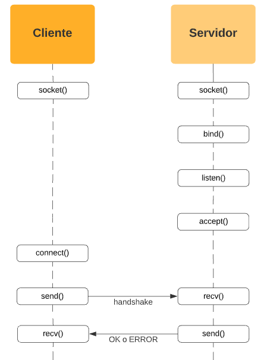

# Guia Sockets para TP0

## Indice
- [¿Que es un Socket?](#que-es-un-socket)
- [¿Que es un modelo Cliente - Servidor?](#que-es-un-modelo-cliente---servidor)
- [IPs y Puertos](#ips-y-puertos)
- [Protocolo de comunicación](#protocolo-de-comunicación)
- [Sockets](#sockets)
    - [Como se crea todo este popurrí](#como-se-crea-todo-esto-popurrí)

### ¿Que es un Socket?

En Linux, TODO es un archivo, por lo que también lo es lo que denominaremos ***SOCKET***, pero será uno especial. Es el archivo que me permite la conexión entre dos ***PROCESOS*** diferentes.

La conexión se realizará entre un modelo cliente - servidor.

### ¿Que es un modelo Cliente - Servidor?

Es un modelo en el que yo tengo un proceso en algún lado que va a recibir múltiples conexiones de otros procesos de otros lados, a los cuales este proceso les va a brindar un servicio. Se definen un cliente y un servidor.

El propósito del cliente es iniciar una conexión contra el servidor para realizar solicitudes, y este último es el que va a entender y resolver. Es responsabilidad del servidor aceptar las conexiones entrantes de los muchos clientes, es decir, ser capaz de atender varios clientes a la vez, y mantener disponibilidad de sus servicios una vez se haya terminado la solicitud de un cliente.

A su vez, los servidores pueden ser clientes de otros servidores. Esta jerarquía puede ser indefinida.

### IPs y Puertos

Lo más importante sobre este tema, sin ondar tan profundo en el tema, sabiendo que está el posteo en el [docs](https://docs.utnso.com.ar/guias/linux/sockets#ips-y-puertos-%C2%BFdonde-atraco-el-barco), es sobre que las IPs tienen una estructura 192.168.xxx.xxx donde xxx va de 0 a 256 y es único para cada dispositivo conectado a la red. 

De paso, tenemos los puertos, que son unidades lógicas, de las cuales el Sistema Operativo nos brinda 2^16 puertos (del 0 al 63535) de los cuales reserva los primeros 1000 para si mismo. Cuando desarrollemos, la comunicación entre los procesos debe ser en puertos que no se utilicen (porque dos procesos no pueden ocupar el mismo puerto al mismo tiempo), generalmente usaremos puertos mayores del ***35000 al 40000***.

### Protocolo de comunicación

Nuestra misión es lograr que dos procesos puedan comunicarse y entenderse entre sí, pero también ser capaces de rechazar clientes que no cumplan con el protocolo. Este proceso se denomina *handshake* entre procesos

El formato general que vamos a utilizar es simil a un vector donde tenemos el *header* (Donde se especifica el tipo de mensaje) y el *payload* que es todo el resto del mensaje que se va a enviar. No necesariamente debe tener un contenido.

### Sockets

El socket no es más que la representación que le da el SO a está conexión entre procesos. Cuando un cliente quiere iniciar una conexión, le pide al SO que cree un socket, que este ocupe un puerto libre, y se conecte con el socket del servidor. Como interviene el SO, hay llamadas al sistema.

#### Como se crea todo esto popurrí

- Se crea el socket con la syscall `socket()`
- Se le asocia un puerto, en un proceso llamado *bindear*, con la syscall `bind()` y por otro lado, tenemos a `listen()` que toma ese socket y lo marca como un socket que su única misión es escuchar conexiones al servidor. No es [bloqueante](https://github.com/KevinQ73/TPs-SO/blob/main/1er%20Parcial/Procesos%20e%20hilos/Procesos%20e%20hilos.md#dinamica-de-estados), y solo marca un flag en 1 para avisar que está en modo listen.
- Una vez hecho todo, y el socket esté escuchando, el servidor utilizará `accept()`, la cual es bloqueante, osea que se va a quedar en accept hasta que el cliente intente conectarse usando `connect()`. Si el cliente intenta conectarse y no está en accept el servidor, fallará y devolverá un error.
- Una vez hecha la conexión, `accept()` me creará un socket nuevo para la comunicación bidereccional entre servidor y cliente. Por cada accept que haga, voy a tener un nuevo socket, y si quiero comunicarme con mis clientes, debo almancenar esos sockets. La comunicación bidereccional es entre el socket que realizó connect con el servidor y el que devuelve el servidor con accept, el que está marcado como listen ni pincha ni corta porque su función solo es escuchar nuevos clientes.
- Para el final de todo esto, como ya está realizada la conexión, se realizarán los handshakes que envía un paquete que le diga al servidor "Somos bros, bro" y este le responda si le entiende o no, respondiendo como corresponde.
- Para ver todo esto, se utilizan las syscalls `send()` y `recv()` que se encargan de mover bytes de datos a través de la red, recv es bloqueante solo al inicio del handshake porque está pasando el flag `MSG_WAITALL` que espera a que llegue por socket los bytes que se ponen por parámetro.
- Cuando estamos con datos más complejos, necesitamos de la serialización para poder comprimir y descomprimir los mensajes que se van a enviar.
- Al final de todo, se tiene que cerrar el socket con `close(socket)`, generalmente del lado del cliente. Es IMPORTANTÍSIMO porque sino, no se libera el puerto.
